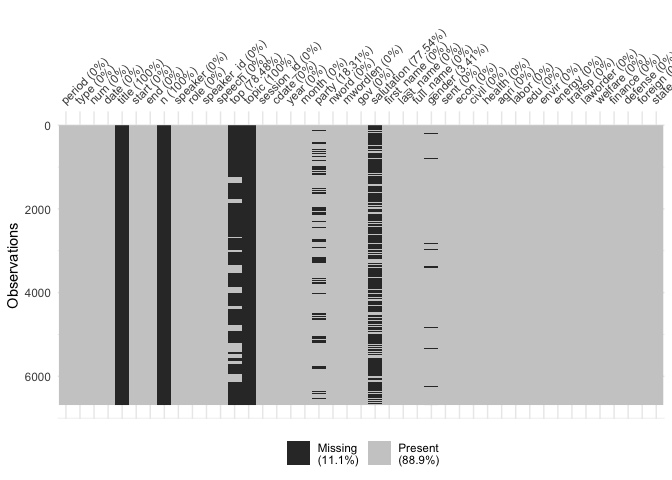
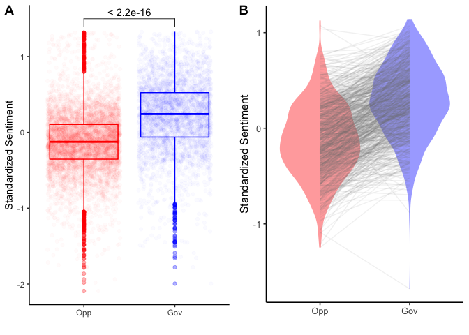
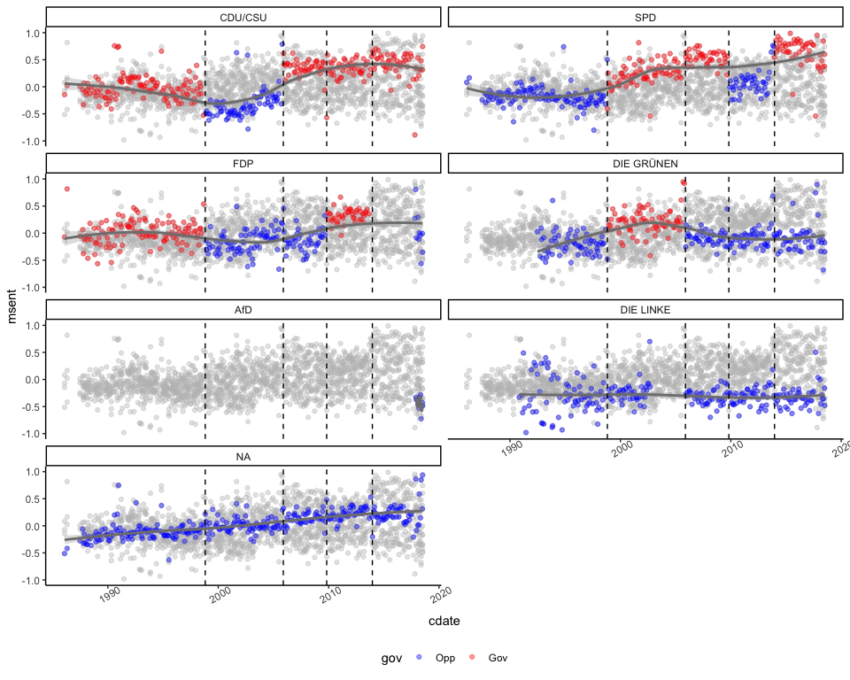
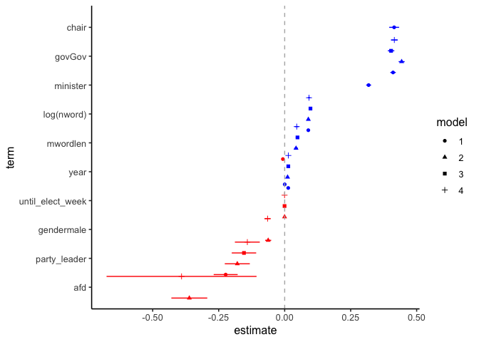
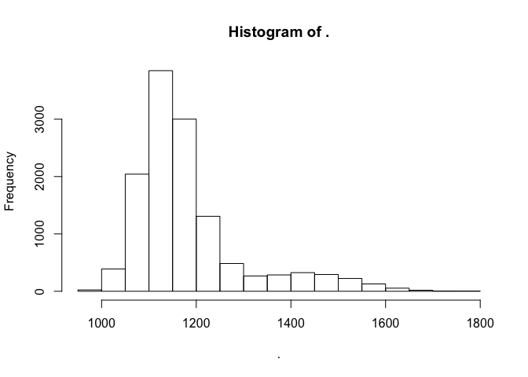
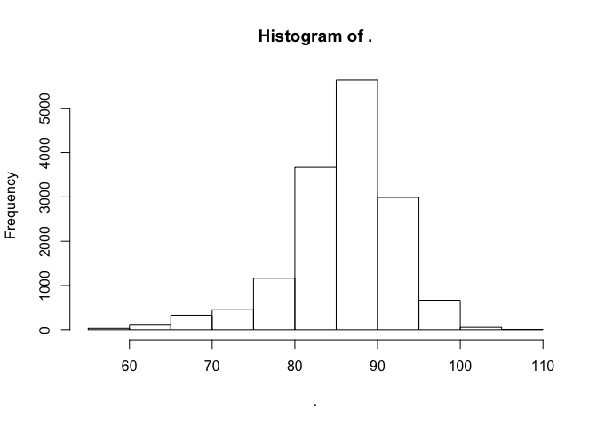
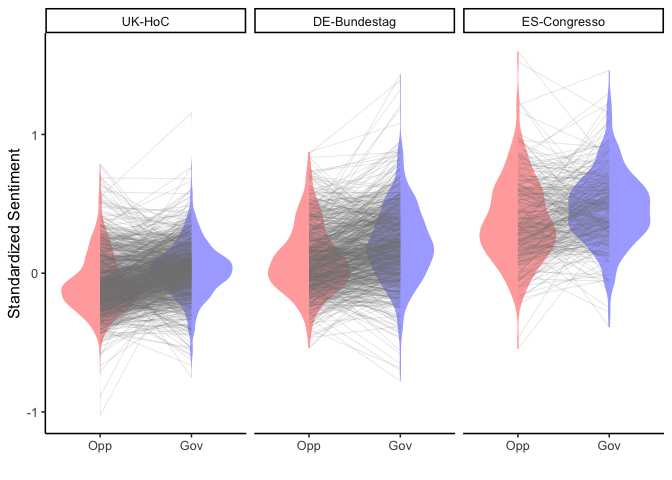
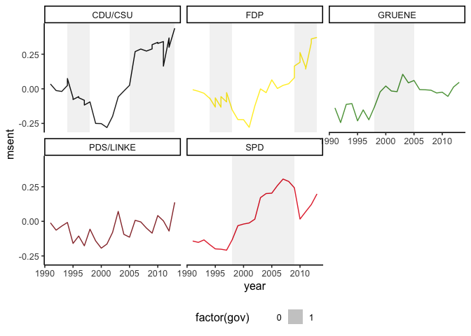
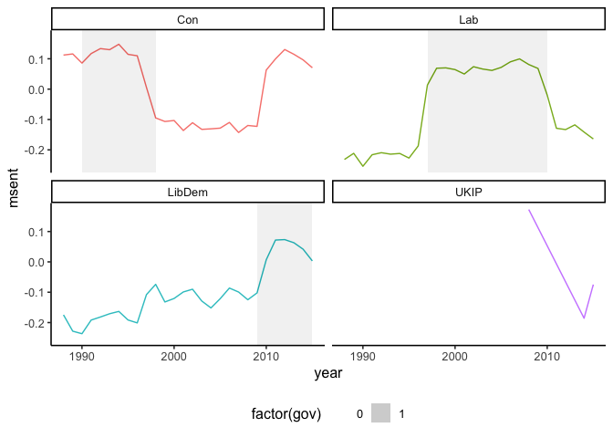

The Good, the Bad, and the Ugly
================

Packages
--------

``` r
pacman::p_load(tidyverse, purrr, lubridate, visdat, glue, ggpubr, janitor, tidyr, arm, stargazer, broom, ggthemes, stringr, forcats)

theme_set(theme_classic2())

add_election <- function(x){
  x %>%
    split(.$party) %>%
    map(~{
      .x %>% 
      unique %>%
      geom_rect(
        data = ., 
        aes(xmin = year, xmax = dplyr::lead(year), ymin = -Inf, ymax = Inf, fill = factor(gov)), 
        color = NA, alpha = .1
      )
    })
}
```

German Bundestag Speeches
=========================

Parsed from XML Files.

This is the regex to extract features like party\_leder (group) for each legislative period.

``` r
party_leader19 <- c(
  "Alexander Gauland", "Alice Weidel",
  "Volker Kauder", 
  "Andrea Nahles",
  "Christian Lindner",
  "Anton Hofreiter", "Katrin Göring-Eckardt",
  "Dietmar Bartsch", "Sahra Wagenknecht"
) %>% paste(collapse = "|")

party_leader18 <- c(
  "Volker Kauder", 
  "Thomas Oppermann",
  "Anton Hofreiter", "Katrin Göring-Eckardt",
  "Dietmar Bartsch", "Sahra Wagenknecht"
) %>% paste(collapse = "|")

party_leader17 <- c(
  "Volker Kauder", 
  "Frank-Walter Steinmeier",
  "Rainer Brüderle",
  "Renate Künast", "Jürgen Trittin",
  "Gregor Gysi"
) %>% paste(collapse = "|")

party_leader16 <- c(
  "Volker Kauder", 
  "Peter Struck",
  "Birgit Homburger", "Guido Westerwelle",
  "Renate Künast", "Fritz Kuhn",
  "Gregor Gysi", "Oskar Lafontaine"
) %>% paste(collapse = "|")

party_leader15 <- c(
  "Angela Merkel",
  "Volker Kauder", 
  "Franz Müntefering",
  "Wolfgang Gerhardt",
  "Krista Sager", "Katrin Göring-Eckardt"
) %>% paste(collapse = "|")


party_leader14 <- c(
  "Wolfgang Schäuble",
  "Peter Struck", "Ludwig Stiegler",
  "Wolfgang Gerhardt",
  "Kerstin Müller", "Rezzo Schlauch",
  "Gregor Gysi"
) %>% paste(collapse = "|")

party_leader13 <- c(
  "Wolfgang Schäuble",
  "Rudolf Scharping",
  "Hermann Otto Solms",
  "Joschka Fischer", "Kerstin Müller"
) %>% paste(collapse = "|")

chairs <- c("Bundestagspr.sident", "Bundestagspräsidentin", "Alterspräsident", "Alterspräsidentin", "Bundespräsindet", "Präsidentin", "Präsident")
```

The Bundestags speeches have been parsed before hand. Sentiment predictions, as well as topic assignemnts have been computed seperatly.

``` r
load("data/plenary_final.Rdata")

ps <- plenary_final %>% 
  mutate(sentz = scale(sent)[, 1]) %>%
  #filter(party != "none") %>%
  drop_na(speaker) %>%
  mutate(gov = ifelse(gov == 1, "Gov", "Opp") %>% factor(., levels = c("Opp", "Gov"))) %>% 
  mutate(
    week = lubridate::week(cdate), 
    year = lubridate::year(cdate),
    date_index = glue::glue("{year}_{week}")
  ) %>% 
  group_by(period) %>% 
  arrange(desc(cdate)) %>% 
  mutate(
    until_elect = cdate %>% as.factor %>% as.numeric,
    until_elect_week = date_index %>% as.factor %>% as.numeric
  ) %>% 
  ungroup %>% 
  mutate(chair = ifelse(role %in% chairs, 1, 0)) %>% 
  mutate(minister = ifelse(is.na(party) & !role %in% chairs, 1, 0)) %>% 
  mutate(
    party_leader = case_when(
      period == 19 & str_detect(speaker, party_leader19) ~ 1,
      period == 18 & str_detect(speaker, party_leader18) ~ 1,
      period == 17 & str_detect(speaker, party_leader17) ~ 1,
      period == 16 & str_detect(speaker, party_leader16) ~ 1,
      period == 15 & str_detect(speaker, party_leader15) ~ 1,
      period == 14 & str_detect(speaker, party_leader14) ~ 1,
      period == 13 & str_detect(speaker, party_leader13) ~ 1,
      T ~ 0
    )
  ) %>% 
  mutate(nword100 = (nword/100)) %>% 
  mutate(dr = ifelse(is.na(salutation), 0, 1)) %>%
  mutate(mwordlen = scale(mwordlen)[,1], nword100 = scale(nword)[, 1]) %>% 
  mutate(afd = ifelse(party == "AfD", 1, 0))

glimpse(ps)
```

    ## Observations: 263,369
    ## Variables: 54
    ## $ period           <chr> "19", "19", "19", "19", "19", "19", "19", "19...
    ## $ type             <chr> "PLENARPROTOKOLL", "PLENARPROTOKOLL", "PLENAR...
    ## $ num              <chr> "19/46", "19/46", "19/46", "19/46", "19/46", ...
    ## $ date             <chr> "05.07.2018", "05.07.2018", "05.07.2018", "05...
    ## $ title            <chr> NA, NA, NA, NA, NA, NA, NA, NA, NA, NA, NA, N...
    ## $ start            <int> 1, 39, 60, 81, 94, 101, 112, 137, 157, 188, 2...
    ## $ end              <dbl> 38, 59, 80, 90, 100, 111, 136, 156, 187, 201,...
    ## $ n                <dbl> NA, NA, NA, NA, NA, NA, NA, NA, NA, NA, NA, N...
    ## $ speaker          <chr> "Dr. Wolfgang Schäuble", "Martin Hess", "Klau...
    ## $ role             <chr> "Präsident", "AfD", "CDU/CSU", "FDP", "AfD", ...
    ## $ speaker_id       <int> 1, 2, 3, 4, 6, 7, 8, 9, 10, 11, 13, 14, 15, 1...
    ## $ speech           <chr> " Guten Morgen, liebe Kolleginnen und Kollege...
    ## $ top              <chr> NA, NA, NA, NA, NA, NA, NA, NA, NA, NA, NA, N...
    ## $ topic            <chr> NA, NA, NA, NA, NA, NA, NA, NA, NA, NA, NA, N...
    ## $ session_id       <int> 46, 46, 46, 46, 46, 46, 46, 46, 46, 46, 46, 4...
    ## $ cdate            <date> 2018-07-05, 2018-07-05, 2018-07-05, 2018-07-...
    ## $ year             <dbl> 2018, 2018, 2018, 2018, 2018, 2018, 2018, 201...
    ## $ month            <dbl> 7, 7, 7, 7, 7, 7, 7, 7, 7, 7, 7, 7, 7, 7, 7, ...
    ## $ party            <chr> NA, "AfD", "CDU/CSU", "FDP", "AfD", "FDP", "S...
    ## $ nword            <int> 693, 701, 1015, 602, 205, 209, 865, 689, 943,...
    ## $ mwordlen         <dbl> 0.55584703, 0.86792441, -0.15783162, -0.24210...
    ## $ gov              <fct> Opp, Opp, Gov, Opp, Opp, Opp, Gov, Opp, Opp, ...
    ## $ salutation       <chr> "Dr.", NA, NA, "Dr.", NA, "Dr.", NA, NA, "Dr....
    ## $ first_name       <chr> "Wolfgang", "Martin", "Klaus-Dieter", "Stefan...
    ## $ last_name        <chr> "SchA$uble", "Hess", "GrA?hler", "Ruppert", "...
    ## $ full_name        <chr> "Dr. Wolfgang SchA$uble", "Martin Hess", "Kla...
    ## $ gender           <chr> "male", "male", "male", "male", "male", "male...
    ## $ sent             <dbl> 0.84375322, 0.06794232, 0.91622263, 0.6305902...
    ## $ econ             <dbl> 0.009, 0.003, 0.020, 0.004, 0.008, 0.234, 0.0...
    ## $ civil            <dbl> 0.711, 0.179, 0.000, 0.617, 0.015, 0.007, 0.1...
    ## $ health           <dbl> 0.001, 0.265, 0.004, 0.008, 0.003, 0.025, 0.0...
    ## $ agri             <dbl> 0.000, 0.001, 0.037, 0.000, 0.022, 0.000, 0.0...
    ## $ labor            <dbl> 0.010, 0.003, 0.002, 0.005, 0.002, 0.097, 0.0...
    ## $ edu              <dbl> 0.020, 0.032, 0.003, 0.011, 0.014, 0.128, 0.1...
    ## $ envir            <dbl> 0.000, 0.010, 0.008, 0.001, 0.005, 0.002, 0.0...
    ## $ energy           <dbl> 0.000, 0.001, 0.012, 0.000, 0.001, 0.000, 0.0...
    ## $ transp           <dbl> 0.003, 0.000, 0.001, 0.000, 0.008, 0.007, 0.0...
    ## $ laworder         <dbl> 0.008, 0.239, 0.019, 0.355, 0.081, 0.022, 0.0...
    ## $ welfare          <dbl> 0.002, 0.085, 0.000, 0.018, 0.002, 0.197, 0.0...
    ## $ finance          <dbl> 0.001, 0.004, 0.917, 0.002, 0.159, 0.054, 0.0...
    ## $ defense          <dbl> 0.001, 0.013, 0.000, 0.004, 0.004, 0.000, 0.0...
    ## $ foreign          <dbl> 0.013, 0.013, 0.021, 0.023, 0.064, 0.003, 0.0...
    ## $ state            <dbl> 0.263, 0.022, 0.051, 0.033, 0.399, 0.154, 0.0...
    ## $ sentz            <dbl> 0.8025199, -1.8774848, 1.0528623, 0.0661576, ...
    ## $ week             <dbl> 27, 27, 27, 27, 27, 27, 27, 27, 27, 27, 27, 2...
    ## $ date_index       <S3: glue> "2018_27", "2018_27", "2018_27", "2018_2...
    ## $ until_elect      <dbl> 46, 46, 46, 46, 46, 46, 46, 46, 46, 46, 46, 4...
    ## $ until_elect_week <dbl> 12, 12, 12, 12, 12, 12, 12, 12, 12, 12, 12, 1...
    ## $ chair            <dbl> 1, 0, 0, 0, 0, 0, 0, 0, 0, 0, 0, 0, 0, 0, 0, ...
    ## $ minister         <dbl> 0, 0, 0, 0, 0, 0, 0, 0, 0, 1, 1, 0, 0, 0, 0, ...
    ## $ party_leader     <dbl> 0, 0, 0, 0, 0, 0, 0, 0, 0, 0, 0, 0, 0, 0, 0, ...
    ## $ nword100         <dbl> 0.89277106, 0.91341604, 1.72373136, 0.6579344...
    ## $ dr               <dbl> 1, 0, 0, 1, 0, 1, 0, 0, 1, 0, 0, 0, 0, 0, 1, ...
    ## $ afd              <dbl> NA, 1, 0, 0, 1, 0, 0, 0, 0, NA, NA, 1, 0, 0, ...

Get an understanding of the missingness in the data.

``` r
plenary_final %>% 
  filter(period == 19) %>%
  vis_miss()
```



Mean/Median of government and opposition members and a speaker-wise comparision of PMs who switch to government status (at least once).

``` r
party_box <- ps %>%
  group_by(cdate, party, gov) %>%
  summarise(sentz = mean(sentz)) %>%
  ungroup %>%
  ggplot(aes(gov, sentz, colour = gov)) +
  #geom_histogram(color = NA, alpha = .5) +
  geom_boxplot(alpha = .3) +
  geom_jitter(alpha = .02) +
  theme_classic() +
  scale_colour_manual("", values = c("red", "blue")) +
  labs(x = "", y = "Standardized Sentiment") + 
  stat_compare_means(method = "t.test", comparisons = list(c("Gov", "Opp")))

speaker_compare <- ps %>%
  group_by(speaker, party, gov) %>%
  summarise(sentz = mean(sentz), n = n()) %>%
  ungroup %>% 
  filter(n > 5) %>% 
  arrange(speaker) %>% 
  group_by(speaker) %>% 
  mutate(n_speaker = n()) %>%
  ungroup %>% 
  filter(n_speaker > 1) 

gg_speaker <- speaker_compare %>% 
  #filter(sentz > -1.5) %>% 
  filter(party %in% c("CDU/CSU", "SPD", "DIE GRÜNEN", "FDP")) %>% 
  mutate(party = factor(party, levels = c("CDU/CSU", "SPD", "DIE GRÜNEN", "FDP"))) %>% 
  ggplot(aes(gov, sentz, fill = gov)) +
  geom_violin(alpha = .4, color = NA) +
  geom_line(aes(group = speaker), alpha = .1, color = "gray50") +
  labs(x = "", y = "Standardized Sentiment") + 
  scale_fill_manual("", values = c("red", "blue")) 

ggpubr::ggarrange(party_box, gg_speaker, ncol=2, nrow=1, common.legend = TRUE, legend="none", labels = c("A", "B"))
```



``` r
# devtools::install_github("yutannihilation/gghighlight")
vlines <- tibble(
  cdate = c("2013-12-17", "2009-10-28", "2005-11-22", "1998-10-27") %>%  as.Date
)

gg_sent_party <- ps %>% 
  mutate(party = factor(party, levels = c("CDU/CSU", "SPD",  "FDP", "DIE GRÜNEN", "AfD", "DIE LINKE"))) %>% 
  group_by(year, month, party, gov) %>% 
  summarise(msent = mean(sentz), cdate = cdate[1]) %>% 
  ungroup %>% 
  ggplot(aes(cdate, msent, colour = gov)) +
  geom_point(alpha = .4) +
  gghighlight::gghighlight(use_direct_label = F) +
  facet_wrap(~party, ncol = 2) +
  geom_smooth(aes(group = party), color = "gray50", alpha = .3) +
  xlim(as.Date("1986-01-01"), as.Date("2018-08-01")) +
  scale_colour_manual(values = c("blue", "red"))  +
  ylim(-1, 1) +
  theme_classic() +
  theme(legend.position = "bottom", axis.text.x = element_text(angle = 30)) +
  geom_vline(data = vlines, aes(xintercept = cdate), linetype = "dashed") 

gg_sent_party
```



Modeling Sentiment
------------------

``` r
fit_sent_gov_ols1 <- ps %>% 
  lm(sentz ~ gov, data = .)

fit_sent_gov_ols2 <- ps %>% 
  lm(sentz ~ gov + party_leader + minister + chair, data = .)

fit_sent_gov_ols3 <- ps %>% 
  lm(sentz ~ gov + party_leader + minister + chair + until_elect_week + year + mwordlen + log(nword), data = .)

fit_sent_gov_ols4 <- ps %>%
  lm(sentz ~ gov + party_leader + minister + chair + until_elect_week + year + mwordlen + log(nword) + gender + afd, data = .)


fit_sent_gov_ml1 <- ps %>% 
  lmer(sentz ~ gov + (1|party), data = .)

fit_sent_gov_ml2 <- ps %>% 
  lmer(sentz ~ gov + party_leader + minister + chair + (1|party), data = .)

fit_sent_gov_ml3 <- ps %>% 
  lmer(sentz ~ gov + party_leader + minister + chair + until_elect_week + year + mwordlen + log(nword) + (1|party), data = .)

fit_sent_gov_ml4 <- ps %>% 
  lmer(sentz ~ gov + party_leader + minister + chair + until_elect_week + year + mwordlen + log(nword) + gender + afd + (1|party), data = .)

stargazer::stargazer(
  list(
    fit_sent_gov_ols2, 
    fit_sent_gov_ols3, 
    fit_sent_gov_ols4,
    fit_sent_gov_ml2, 
    fit_sent_gov_ml3,
    fit_sent_gov_ml4
  ), 
  type = "html", 
  header = F, title = "Modeling Government vs Opposition Sentiment", font.size = "scriptsize", style = "ajps"
  #out = "coef_table.tex"
)
```

<table style="text-align:center">
<caption>
<strong>Modeling Government vs Opposition Sentiment</strong>
</caption>
<tr>
<td colspan="7" style="border-bottom: 1px solid black">
</td>
</tr>
<tr>
<td style="text-align:left">
</td>
<td colspan="6">
<strong>sentz</strong>
</td>
</tr>
<tr>
<td style="text-align:left">
</td>
<td colspan="3">
<strong>OLS</strong>
</td>
<td colspan="3">
<strong>linear</strong>
</td>
</tr>
<tr>
<td style="text-align:left">
</td>
<td colspan="3">
<strong></strong>
</td>
<td colspan="3">
<strong>mixed-effects</strong>
</td>
</tr>
<tr>
<td style="text-align:left">
</td>
<td>
<strong>Model 1</strong>
</td>
<td>
<strong>Model 2</strong>
</td>
<td>
<strong>Model 3</strong>
</td>
<td>
<strong>Model 4</strong>
</td>
<td>
<strong>Model 5</strong>
</td>
<td>
<strong>Model 6</strong>
</td>
</tr>
<tr>
<td colspan="7" style="border-bottom: 1px solid black">
</td>
</tr>
<tr>
<td style="text-align:left">
govGov
</td>
<td>
0.459<sup>\*\*\*</sup>
</td>
<td>
0.411<sup>\*\*\*</sup>
</td>
<td>
0.443<sup>\*\*\*</sup>
</td>
<td>
0.489<sup>\*\*\*</sup>
</td>
<td>
0.403<sup>\*\*\*</sup>
</td>
<td>
0.415<sup>\*\*\*</sup>
</td>
</tr>
<tr>
<td style="text-align:left">
</td>
<td>
(0.005)
</td>
<td>
(0.005)
</td>
<td>
(0.006)
</td>
<td>
(0.006)
</td>
<td>
(0.006)
</td>
<td>
(0.007)
</td>
</tr>
<tr>
<td style="text-align:left">
party\_leader
</td>
<td>
-0.146<sup>\*\*\*</sup>
</td>
<td>
-0.224<sup>\*\*\*</sup>
</td>
<td>
-0.179<sup>\*\*\*</sup>
</td>
<td>
-0.131<sup>\*\*\*</sup>
</td>
<td>
-0.154<sup>\*\*\*</sup>
</td>
<td>
-0.141<sup>\*\*\*</sup>
</td>
</tr>
<tr>
<td style="text-align:left">
</td>
<td>
(0.023)
</td>
<td>
(0.023)
</td>
<td>
(0.024)
</td>
<td>
(0.024)
</td>
<td>
(0.024)
</td>
<td>
(0.024)
</td>
</tr>
<tr>
<td style="text-align:left">
minister
</td>
<td>
0.216<sup>\*\*\*</sup>
</td>
<td>
0.318<sup>\*\*\*</sup>
</td>
<td>
</td>
<td>
</td>
<td>
</td>
<td>
</td>
</tr>
<tr>
<td style="text-align:left">
</td>
<td>
(0.005)
</td>
<td>
(0.005)
</td>
<td>
</td>
<td>
</td>
<td>
</td>
<td>
</td>
</tr>
<tr>
<td style="text-align:left">
chair
</td>
<td>
0.358<sup>\*\*\*</sup>
</td>
<td>
0.415<sup>\*\*\*</sup>
</td>
<td>
</td>
<td>
</td>
<td>
</td>
<td>
</td>
</tr>
<tr>
<td style="text-align:left">
</td>
<td>
(0.010)
</td>
<td>
(0.010)
</td>
<td>
</td>
<td>
</td>
<td>
</td>
<td>
</td>
</tr>
<tr>
<td style="text-align:left">
until\_elect\_week
</td>
<td>
</td>
<td>
0.0002<sup>\*\*</sup>
</td>
<td>
-0.0004<sup>\*\*\*</sup>
</td>
<td>
</td>
<td>
-0.0005<sup>\*\*\*</sup>
</td>
<td>
-0.0005<sup>\*\*\*</sup>
</td>
</tr>
<tr>
<td style="text-align:left">
</td>
<td>
</td>
<td>
(0.0001)
</td>
<td>
(0.0001)
</td>
<td>
</td>
<td>
(0.0001)
</td>
<td>
(0.0001)
</td>
</tr>
<tr>
<td style="text-align:left">
year
</td>
<td>
</td>
<td>
0.014<sup>\*\*\*</sup>
</td>
<td>
0.011<sup>\*\*\*</sup>
</td>
<td>
</td>
<td>
0.014<sup>\*\*\*</sup>
</td>
<td>
0.014<sup>\*\*\*</sup>
</td>
</tr>
<tr>
<td style="text-align:left">
</td>
<td>
</td>
<td>
(0.0002)
</td>
<td>
(0.0004)
</td>
<td>
</td>
<td>
(0.0003)
</td>
<td>
(0.0004)
</td>
</tr>
<tr>
<td style="text-align:left">
mwordlen
</td>
<td>
</td>
<td>
-0.007<sup>\*\*\*</sup>
</td>
<td>
0.043<sup>\*\*\*</sup>
</td>
<td>
</td>
<td>
0.049<sup>\*\*\*</sup>
</td>
<td>
0.046<sup>\*\*\*</sup>
</td>
</tr>
<tr>
<td style="text-align:left">
</td>
<td>
</td>
<td>
(0.002)
</td>
<td>
(0.004)
</td>
<td>
</td>
<td>
(0.003)
</td>
<td>
(0.004)
</td>
</tr>
<tr>
<td style="text-align:left">
log(nword)
</td>
<td>
</td>
<td>
0.090<sup>\*\*\*</sup>
</td>
<td>
0.090<sup>\*\*\*</sup>
</td>
<td>
</td>
<td>
0.098<sup>\*\*\*</sup>
</td>
<td>
0.092<sup>\*\*\*</sup>
</td>
</tr>
<tr>
<td style="text-align:left">
</td>
<td>
</td>
<td>
(0.002)
</td>
<td>
(0.002)
</td>
<td>
</td>
<td>
(0.002)
</td>
<td>
(0.002)
</td>
</tr>
<tr>
<td style="text-align:left">
gendermale
</td>
<td>
</td>
<td>
</td>
<td>
-0.063<sup>\*\*\*</sup>
</td>
<td>
</td>
<td>
</td>
<td>
-0.065<sup>\*\*\*</sup>
</td>
</tr>
<tr>
<td style="text-align:left">
</td>
<td>
</td>
<td>
</td>
<td>
(0.006)
</td>
<td>
</td>
<td>
</td>
<td>
(0.006)
</td>
</tr>
<tr>
<td style="text-align:left">
afd
</td>
<td>
</td>
<td>
</td>
<td>
-0.361<sup>\*\*\*</sup>
</td>
<td>
</td>
<td>
</td>
<td>
-0.391<sup>\*\*\*</sup>
</td>
</tr>
<tr>
<td style="text-align:left">
</td>
<td>
</td>
<td>
</td>
<td>
(0.035)
</td>
<td>
</td>
<td>
</td>
<td>
(0.145)
</td>
</tr>
<tr>
<td style="text-align:left">
Constant
</td>
<td>
-0.208<sup>\*\*\*</sup>
</td>
<td>
-27.762<sup>\*\*\*</sup>
</td>
<td>
-22.605<sup>\*\*\*</sup>
</td>
<td>
-0.262<sup>\*\*\*</sup>
</td>
<td>
-28.231<sup>\*\*\*</sup>
</td>
<td>
-28.632<sup>\*\*\*</sup>
</td>
</tr>
<tr>
<td style="text-align:left">
</td>
<td>
(0.003)
</td>
<td>
(0.451)
</td>
<td>
(0.707)
</td>
<td>
(0.048)
</td>
<td>
(0.678)
</td>
<td>
(0.741)
</td>
</tr>
<tr>
<td style="text-align:left">
N
</td>
<td>
263369
</td>
<td>
263369
</td>
<td>
130509
</td>
<td>
143322
</td>
<td>
143322
</td>
<td>
130509
</td>
</tr>
<tr>
<td style="text-align:left">
R-squared
</td>
<td>
0.029
</td>
<td>
0.057
</td>
<td>
0.077
</td>
<td>
</td>
<td>
</td>
<td>
</td>
</tr>
<tr>
<td style="text-align:left">
Adj. R-squared
</td>
<td>
0.029
</td>
<td>
0.057
</td>
<td>
0.077
</td>
<td>
</td>
<td>
</td>
<td>
</td>
</tr>
<tr>
<td style="text-align:left">
Log Likelihood
</td>
<td>
</td>
<td>
</td>
<td>
</td>
<td>
-203459.100
</td>
<td>
-201314.600
</td>
<td>
-183222.600
</td>
</tr>
<tr>
<td style="text-align:left">
Residual Std. Error
</td>
<td>
0.985 (df = 263364)
</td>
<td>
0.971 (df = 263360)
</td>
<td>
0.991 (df = 130500)
</td>
<td>
</td>
<td>
</td>
<td>
</td>
</tr>
<tr>
<td style="text-align:left">
F Statistic
</td>
<td>
1994.321<sup>\*\*\*</sup> (df = 4; 263364)
</td>
<td>
2000.666<sup>\*\*\*</sup> (df = 8; 263360)
</td>
<td>
1362.019<sup>\*\*\*</sup> (df = 8; 130500)
</td>
<td>
</td>
<td>
</td>
<td>
</td>
</tr>
<tr>
<td style="text-align:left">
AIC
</td>
<td>
</td>
<td>
</td>
<td>
</td>
<td>
406928.200
</td>
<td>
402647.200
</td>
<td>
366467.200
</td>
</tr>
<tr>
<td style="text-align:left">
BIC
</td>
<td>
</td>
<td>
</td>
<td>
</td>
<td>
406977.500
</td>
<td>
402736.100
</td>
<td>
366574.800
</td>
</tr>
<tr>
<td colspan="7" style="border-bottom: 1px solid black">
</td>
</tr>
<tr>
<td colspan="7" style="text-align:left">
<sup>***</sup>p &lt; .01; <sup>**</sup>p &lt; .05; <sup>*</sup>p &lt; .1
</td>
</tr>
</table>
Point Estimates and Confidence Intervals (95%) for each model and term

``` r
params <- list(
    #fit_sent_gov_ols2, 
    fit_sent_gov_ols3, 
    fit_sent_gov_ols4,
    #fit_sent_gov_ml2, 
    fit_sent_gov_ml3,
    fit_sent_gov_ml4
  ) %>% 
  map2(.y = 1:length(.),~{
    tidy(.x) %>% 
      mutate(model = paste0(.y)) 
  }) %>% 
  bind_rows()

pd <- position_dodge(width = 1.5)
params %>% 
  mutate(color = ifelse(estimate > 0, "1", "0")) %>% 
  mutate(term = forcats::fct_reorder(term, estimate)) %>% 
  filter(!term %in% c("(Intercept)", "sd_Observation.Residual", "sd_(Intercept).party")) %>% 
  ggplot(aes(term, estimate, colour = color, shape = model)) +
  geom_point(position = pd) +
  geom_linerange(
    aes(
      ymin = estimate - 1.96*std.error, 
      ymax = estimate + 1.96*std.error),
    position = pd
  ) +
  coord_flip() +
  geom_violin(color = "black") +
  geom_hline(yintercept = 0, linetype = "dashed", color = "gray70") +
  guides(colour = F) +
  scale_colour_manual(values = c("red", "blue"))
```



Multiligual Sentiment
=====================

Download original parlspeech data from [HERE](https://dataverse.harvard.edu/dataset.xhtml?persistentId=doi:10.7910/DVN/E4RSP9) and place them into the data/parlspeech folder.

``` r
parl_corpora <- dir("data/parlspeech") %>% 
  purrr::keep(~str_detect(.x, "Corp")) %>% 
  #purrr::map(~get(load(.x))) %>%
  furrr::future_map(~get(load(glue::glue("data/parlspeech/{.x}")))) %>% 
  map_df(~.x %>% mutate_at(vars(session, speechnumber), as.character)) %>% 
  mutate(
    nwords = str_count(text, "\\W+"),
    nchars = nchar(text)
  ) %>%
  mutate(id = glue::glue("{parliament}_{session}_{speechnumber}"))

glimpse(parl_corpora)
```

    ## Observations: 2,130,589
    ## Variables: 12
    ## $ date         <chr> "1991-03-12", "1991-03-12", "1991-03-12", "1991-0...
    ## $ session      <chr> "13", "13", "13", "13", "13", "13", "13", "13", "...
    ## $ speechnumber <chr> "2", "3", "4", "5", "6", "7", "8", "9", "10", "11...
    ## $ speaker      <chr> "Theodor Waigel", "Rita Süssmuth", "Theodor Waige...
    ## $ party        <chr> "CDU/CSU", "CDU/CSU", "CDU/CSU", "CDU/CSU", "PDS/...
    ## $ chair        <lgl> FALSE, TRUE, FALSE, TRUE, FALSE, TRUE, FALSE, TRU...
    ## $ terms        <dbl> 880, 15, 5756, 69, 233, 9, 242, 8, 31, 6, 298, 9,...
    ## $ text         <chr> "Frau Präsidentin ! Meine sehr geehrten Damen und...
    ## $ parliament   <chr> "DE-Bundestag", "DE-Bundestag", "DE-Bundestag", "...
    ## $ nwords       <int> 769, 11, 5124, 63, 207, 7, 207, 7, 25, 5, 259, 8,...
    ## $ nchars       <int> 5769, 66, 38573, 414, 1637, 43, 1392, 39, 198, 37...
    ## $ id           <S3: glue> "DE-Bundestag_13_2", "DE-Bundestag_13_3", "D...

``` r
parl_corpora %>% 
  filter(nwords > 195 & nwords < 205) %>%
  .$nchars %>% hist  
```



``` r
parl_corpora %>% 
  filter(nchars > 495 & nchars < 505) %>%
  .$nwords %>% hist  
```



Predict Sentiment
-----------------

``` r
library(keras)
options(scipen = 999)

model <- keras::load_model_hdf5("models/cnn_gru_model_86_mac")
char_tokenizer <- keras::load_text_tokenizer("models/char_tokenizer_86_mac")
maxlen <- 500

glimpse(parl_corpora)

parl_preds <- parl_corpora %>%
  dplyr::select(id, text) %>%
  mutate(seq = 1:n() %/% 50000) %>%
  split(.$seq) %>%
  map_df(~{
    print(.x$seq[1])
    parl_char_seq <- char_tokenizer %>% 
      texts_to_sequences(.x$text) %>% 
      pad_sequences(maxlen = maxlen, value = 0)
    
    preds <- predict(model, x = parl_char_seq) %>%
      as_tibble() %>% 
      round(3) %>% 
      set_names(c("sent", "de", "es", "uk")) 
    
    all <- bind_cols(.x, preds) %>%
      dplyr::select(-text, -seq)
    
    return(all)
  })

glimpse(parl_preds)
#save(parl_preds, file = "data/parl_preds.Rdata")
```

Bind columns of sentiment predictions to the parl speech corpora

``` r
load("data/parl_preds.Rdata")

parl_final <- parl_corpora %>% 
  bind_cols(parl_preds) %>%
  filter(nchars > 20) %>%
  filter(!chair) %>%
  filter(party %in% c("Con", "Lab", "LibDem", "UKIP", 
                      "PSOE", "PP", 
                      "CDU/CSU", "SPD", "GRUENE", "FDP", "PDS/LINKE")) %>%
  mutate(sentz = scale(sent)[,1]) %>%
  mutate(year = date %>% as_date %>% year) %>%
  mutate(month = date %>% as_date %>% month) %>% 
  ### Germany
  mutate(
    gov = case_when(
      ## DE
      year  %in% 2015:2018 & party %in% c("Con") ~ 1,
      year  %in% 2009:2015 & party == "LibDem" ~ 1,
      year  %in% 1997:2009 & party %in% "Lab" ~ 1,
      year  %in% 1990:1997 & party %in% "Con" ~ 1,
      ## ES
      year  %in% 2018:2019 & party %in% c("PSOE") ~ 1,
      year  %in% 2011:2018 & party == "PP" ~ 1,
      year  %in% 2004:2011 & party %in% "PSOE" ~ 1,
      year  %in% 1996:2004 & party %in% "PP" ~ 1,
      year  %in% 1982:1996 & party %in% "PSOE" ~ 1,
      ## UK
      year %in% c(2005:2008, 2013:2019) & party %in% c("SPD", "CDU/CSU") ~ 1,
      year == c(1994:1997,  2009:2012) & party %in% c("FDP", "CDU/CSU") ~ 1,
      year %in% 1998:2004 & party %in% c("SPD", "GRUENE") ~ 1,
      F ~ 0
    ) %>% ifelse(is.na(.), 0, .)
  )

## check the join
(parl_final$id1 == parl_final$id) %>% table
```

    ## .
    ##    TRUE 
    ## 1614547

``` r
parl_final %>% glimpse
```

    ## Observations: 1,614,547
    ## Variables: 21
    ## $ date         <chr> "1991-03-12", "1991-03-12", "1991-03-12", "1991-0...
    ## $ session      <chr> "13", "13", "13", "13", "13", "13", "13", "13", "...
    ## $ speechnumber <chr> "2", "4", "6", "8", "10", "12", "14", "15", "17",...
    ## $ speaker      <chr> "Theodor Waigel", "Theodor Waigel", "Barbara Höll...
    ## $ party        <chr> "CDU/CSU", "CDU/CSU", "PDS/LINKE", "CDU/CSU", "SP...
    ## $ chair        <lgl> FALSE, FALSE, FALSE, FALSE, FALSE, FALSE, FALSE, ...
    ## $ terms        <dbl> 880, 5756, 233, 242, 31, 298, 281, 2306, 91, 4066...
    ## $ text         <chr> "Frau Präsidentin ! Meine sehr geehrten Damen und...
    ## $ parliament   <chr> "DE-Bundestag", "DE-Bundestag", "DE-Bundestag", "...
    ## $ nwords       <int> 769, 5124, 207, 207, 25, 259, 237, 2009, 73, 3552...
    ## $ nchars       <int> 5769, 38573, 1637, 1392, 198, 1790, 1671, 14050, ...
    ## $ id           <S3: glue> "DE-Bundestag_13_2", "DE-Bundestag_13_4", "D...
    ## $ id1          <chr> "DE-Bundestag_13_2", "DE-Bundestag_13_4", "DE-Bun...
    ## $ sent         <dbl> 0.073, 0.299, 0.687, 0.609, 0.935, 0.617, 0.299, ...
    ## $ de           <dbl> 1, 1, 1, 1, 1, 1, 1, 1, 1, 1, 1, 1, 1, 1, 1, 1, 1...
    ## $ es           <dbl> 0, 0, 0, 0, 0, 0, 0, 0, 0, 0, 0, 0, 0, 0, 0, 0, 0...
    ## $ uk           <dbl> 0, 0, 0, 0, 0, 0, 0, 0, 0, 0, 0, 0, 0, 0, 0, 0, 0...
    ## $ sentz        <dbl> -1.49928170, -0.50950314, 1.18976272, 0.84815773,...
    ## $ year         <dbl> 1991, 1991, 1991, 1991, 1991, 1991, 1991, 1991, 1...
    ## $ month        <dbl> 3, 3, 3, 3, 3, 3, 3, 3, 3, 3, 3, 3, 3, 3, 3, 3, 3...
    ## $ gov          <dbl> 0, 0, 0, 0, 0, 0, 0, 0, 0, 0, 0, 0, 0, 0, 0, 0, 0...

``` r
parl_final %>%
  mutate(parliament = factor(parliament, levels = c("UK-HoC", "DE-Bundestag", "ES-Congresso"))) %>%
  mutate(gov = ifelse(gov == 1, "Gov", "Opp") %>% factor(., levels = c("Opp", "Gov"))) %>% 
  group_by(parliament, speaker, gov) %>%
  summarise(sentz = mean(sentz), n = n(), sent = mean(sent)) %>%
  ungroup %>% 
  filter(n > 5) %>% 
  arrange(speaker) %>% 
  group_by(speaker) %>% 
  mutate(n_speaker = n()) %>%
  ungroup %>% 
  filter(n_speaker > 1) %>%
  # group_by(parliament) %>%
  # mutate(sentzp = scale(sent)[,1]) %>%
  # ungroup %>% 
  ggplot(aes(gov, sentz, fill = gov)) +
  geom_violin(alpha = .4, color = NA) +
  geom_line(aes(group = speaker), alpha = .2, color = "gray50", size = .3) +
  labs(x = "", y = "Standardized Sentiment") + 
  scale_fill_manual("", values = c("red", "blue")) +
  facet_wrap(~parliament) +
  theme(legend.position = "none")
```



``` r
sent_compare_de <- parl_final %>% 
  filter(nchars > 20) %>%
  filter(!chair) %>%
  filter(parliament == "DE-Bundestag") %>%
  filter(party != "independent") %>%
  mutate(sentz = scale(sent)[,1]) %>%
  mutate(year = date %>% as_date %>% year) %>%
  mutate(month = date %>% as_date %>% month) %>% 
  group_by(parliament, year, party, gov) %>%
  summarise(msent = mean(sentz, na.rm = T), n = n()) %>% 
  ungroup 

party_colors  <- c("SPD" = "#E2001A", 
                   "CDU/CSU" = "black", #"#e95d0f", 
                   "GRUENE" = "#46962b", 
                   "PDS/LINKE" = "#8B1A1A", 
                   "FDP" = "#ffed00",
                   "AfD" = "#00BFFF")

sent_compare_de  %>%
  ggplot(aes(year, msent, colour = party)) +
  geom_line() + 
  facet_wrap(~party) +
  scale_fill_manual(values = c("white", "gray50")) +
  scale_colour_manual(values = party_colors) +
  theme(legend.position = "bottom") +
  guides(color = F) +
  add_election(sent_compare_de)
```



``` r
sent_compare_uk <- parl_final %>%
  filter(nchars > 20) %>%
  filter(!chair) %>%
  filter(parliament == "UK-HoC") %>%
  filter(party %in% c("Con", "Lab", "LibDem", "UKIP")) %>%
  mutate(party = as.character(party)) %>%
  mutate(sentz = scale(sent)[,1]) %>%
  mutate(year = date %>% as_date %>% year) %>%
  mutate(month = date %>% as_date %>% month) %>% 
  group_by(parliament, year, party, gov) %>%
  summarise(msent = mean(sentz, na.rm = T), n = n()) %>% 
  ungroup

sent_compare_uk  %>%
  ggplot(aes(year, msent, colour = party)) +
  geom_line() + 
  facet_wrap(~party) +
  scale_fill_manual(values = c("white", "gray50")) +
  theme(legend.position = "bottom") +
  guides(color = F) +
  add_election(sent_compare_uk)
```



``` r
sent_compare_es <- parl_final %>% 
  filter(nchars > 20) %>%
  filter(!chair) %>%
  filter(parliament == "ES-Congresso") %>%
  filter(party %in% c("PSOE", "PP")) %>% # , "IU", "CiU"
  mutate(sentz = scale(sent)[,1]) %>%
  mutate(year = date %>% as_date %>% year) %>%
  mutate(month = date %>% as_date %>% month) %>% 
  group_by(parliament, year, party, gov) %>%
  summarise(msent = mean(sentz, na.rm = T), n = n()) %>% 
  ungroup

sent_compare_es  %>%
  ggplot(aes(year, msent, colour = party)) +
  geom_line() + 
  facet_wrap(~party, ncol = 1) +
  scale_fill_manual(values = c("white", "gray50")) +
  add_election(sent_compare_es)
```


Session
=======

``` r
sessionInfo()
```

    ## R version 3.5.1 (2018-07-02)
    ## Platform: x86_64-apple-darwin15.6.0 (64-bit)
    ## Running under: macOS High Sierra 10.13.6
    ## 
    ## Matrix products: default
    ## BLAS: /Library/Frameworks/R.framework/Versions/3.5/Resources/lib/libRblas.0.dylib
    ## LAPACK: /Library/Frameworks/R.framework/Versions/3.5/Resources/lib/libRlapack.dylib
    ## 
    ## locale:
    ## [1] en_US.UTF-8/en_US.UTF-8/en_US.UTF-8/C/en_US.UTF-8/en_US.UTF-8
    ## 
    ## attached base packages:
    ## [1] stats     graphics  grDevices utils     datasets  methods   base     
    ## 
    ## other attached packages:
    ##  [1] bindrcpp_0.2.2  ggthemes_4.0.1  broom_0.5.0     stargazer_5.2.2
    ##  [5] arm_1.10-1      lme4_1.1-19     Matrix_1.2-14   MASS_7.3-50    
    ##  [9] janitor_1.1.1   ggpubr_0.2      magrittr_1.5    glue_1.3.0     
    ## [13] visdat_0.5.2    lubridate_1.7.4 forcats_0.3.0   stringr_1.3.1  
    ## [17] dplyr_0.7.8     purrr_0.2.5     readr_1.1.1     tidyr_0.8.2    
    ## [21] tibble_1.4.2    ggplot2_3.1.0   tidyverse_1.2.1
    ## 
    ## loaded via a namespace (and not attached):
    ##  [1] httr_1.3.1             gghighlight_0.1.0.9000 jsonlite_1.5          
    ##  [4] splines_3.5.1          modelr_0.1.2           assertthat_0.2.0      
    ##  [7] cellranger_1.1.0       yaml_2.2.0             globals_0.12.4        
    ## [10] pillar_1.3.1           backports_1.1.2        lattice_0.20-35       
    ## [13] digest_0.6.18          ggsignif_0.4.0         rvest_0.3.2           
    ## [16] minqa_1.2.4            colorspace_1.3-2       cowplot_0.9.3         
    ## [19] htmltools_0.3.6        plyr_1.8.4             pkgconfig_2.0.2       
    ## [22] listenv_0.7.0          haven_1.1.2            scales_1.0.0          
    ## [25] pacman_0.5.0           withr_2.1.2            furrr_0.1.0           
    ## [28] lazyeval_0.2.1         cli_1.0.1              crayon_1.3.4          
    ## [31] readxl_1.1.0           evaluate_0.12          future_1.10.0         
    ## [34] nlme_3.1-137           xml2_1.2.0             tools_3.5.1           
    ## [37] hms_0.4.2              munsell_0.5.0          compiler_3.5.1        
    ## [40] rlang_0.3.0.1          grid_3.5.1             nloptr_1.2.1          
    ## [43] rstudioapi_0.8         labeling_0.3           rmarkdown_1.10        
    ## [46] gtable_0.2.0           codetools_0.2-15       abind_1.4-5           
    ## [49] R6_2.3.0               knitr_1.20             bindr_0.1.1           
    ## [52] rprojroot_1.3-2        stringi_1.2.4          parallel_3.5.1        
    ## [55] Rcpp_1.0.0             tidyselect_0.2.5       coda_0.19-2
